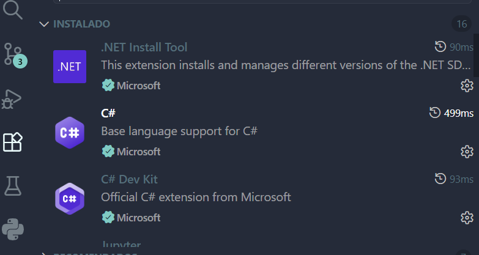
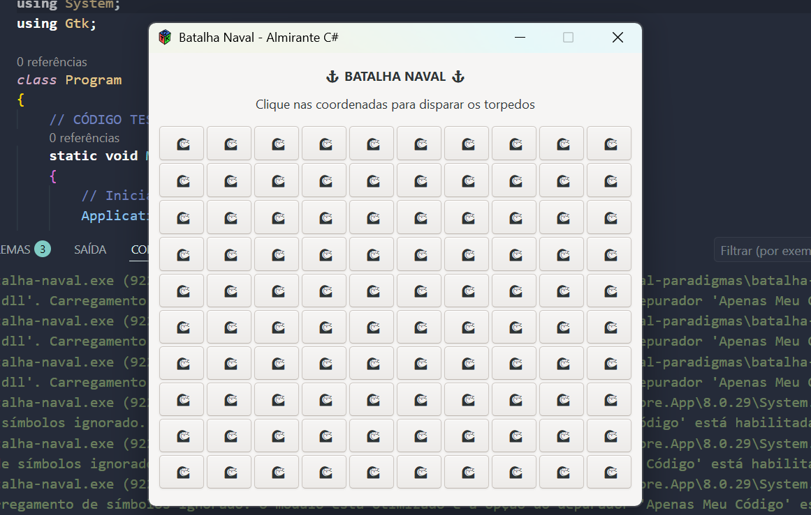

<h1 align="center"> 
	Batalha Naval
</h1>

#### Instalação do C#

> Baixar e instalar a versão `.NET` [versão 8 (LTS)](dotnet.microsoft.com/pt-br/download/dotnet/8.0) no Windows. Verificar também se o PATH foi reconhecido; teste `dotnet --version` no cmd ou terminal.

 

#### Configuração do Ambiente VS Code

> Baixar e habilitar as extesões no VS Code.

 

#### Repositório

> Fazer clone do repositório, colocando em `git clone https://github.com/leticia-academico-uepb/batalha-naval-paradigmas`, abrir a pasta `batalha-naval-paradigmas` na IDE e acessar `batalha-naval` pelo terminal usando `cd`.

 

#### Dependência do GUI
> Instalar o GUI GtkSharp `dotnet add package GtkSharp` pelo terminal. Verificar o VS Code está dentro da pasta `batalha-naval` antes disso. Uma pasta obj será criada automaticamente depois da instalação.

 

#### Execeutar projeto

> Execute `Program.cs` ou digite `dotnet run` no terminal. Se tudo estiver ok, aparecerá a seguinte tela com botões clicáveis que Gemini criou como teste do GUI GtkSharp:

